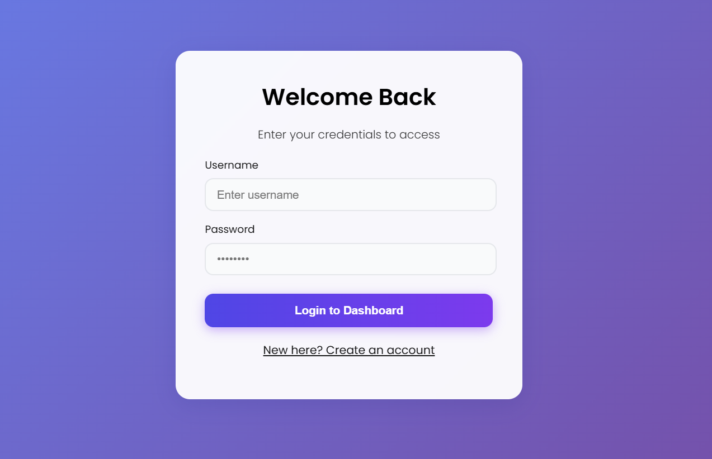

# FINANCEFLOW | INTELLIGENT EXPENSE TRACKER


> A comprehensive, full-stack Personal Finance Dashboard built on the MERN Stack. This assessment project showcases a complete development lifecycle, from secure authentication architecture and RESTful API design to a modern, responsive Glassmorphism UI with real-time data visualization.

---

## 📋 Project Summary

FinanceFlow was developed to address the lack of intuitive tools for personal budget tracking. It replaces manual ledger entries with an automated, visual platform that provides immediate financial insights, secure data isolation per user, and a seamless, animated user experience.

## ✨ Features & Technologies

| Feature Implemented | Technology Used |
| :--- | :--- |
| **Backend Architecture** | Node.js Runtime & Express.js Framework |
| **Database Schema** | MongoDB (NoSQL) & Mongoose ODM |
| **Security & Auth** | JSON Web Tokens (JWT), Bcrypt Hashing, Protected Routes |
| **API Development** | RESTful Architecture, Async/Await Pattern, Middleware |
| **Frontend UI** | React (Vite), CSS3 Variables, Glassmorphism Design |
| **State Management** | React Hooks (`useState`, `useEffect`, `useContext`) |
| **Data Visualization** | Recharts (Dynamic Pie Charts & Legends) |
| **User Experience (UX)** | Framer Motion (Animations), React Toastify (Notifications) |
| **Networking** | Axios (HTTP Client), CORS Configuration |
| **Version Control** | Git, GitHub, `.gitignore` Standards |

---

## 🚀 The Development Journey (All 10 Phases)

### Phase 1 & 2: Architecture & Database
Established the project's MERN scaffolding and database schema.
* **Initialized** the Node.js backend server and React (Vite) frontend client.
* **Modeled** the `User` schema with unique constraints and `Transaction` schema for financial data.
* **Implemented** Git version control with a strict `.gitignore` policy.

### Phase 3: Backend Logic (The Controller Layer)
Developed the core business logic to handle data manipulation.
* **Wrote** asynchronous controller functions for CRUD operations.
* **Implemented** logic to differentiate between Income (positive) and Expense (negative) values automatically.

### Phase 4: Security Implementation
Secured the application using industry-standard protocols.
* **Integrated** `BcryptJS` to hash passwords before saving them to the database.
* **Implemented** `JWT` (JSON Web Tokens) to issue signed tokens upon successful login.
* **Created** custom Middleware to verify tokens and protect private API routes.

### Phase 5: API Routing
Built the RESTful API endpoints to expose backend functionality.
* **Designed** the `/api/auth` routes for Registration and Login.
* **Designed** the `/api/transactions` routes for secure data access.
* **Tested** endpoints using Postman to ensure JSON response reliability.

### Phase 6 & 7: Frontend Foundation & UI Design
Set up the React client and created a modern visual identity.
* **Configured** `React Router DOM` to handle navigation and protected routes.
* **Designed** a custom CSS system using variables for the **"Glassmorphism"** aesthetic.
* **Implemented** responsive layouts using CSS Grid and Flexbox.

### Phase 8: Component Logic & Integration
Connected the Frontend to the Backend.
* **Utilized** `Axios` to perform HTTP requests (GET, POST, DELETE) to the Node server.
* **Managed** complex state updates to refresh the UI instantly upon user actions.
* **Calculated** financial totals (Income vs Expense) dynamically on the client side.

### Phase 9: Data Visualization & UX Polish
Enhanced the application with professional visual features.
* **Integrated** `Recharts` to render a live Pie Chart that updates in real-time.
* **Added** `Framer Motion` to animate list items sliding in and cards floating up.
* **Implemented** `React Toastify` to provide success/error popup notifications.

### Phase 10: Final Deployment & Documentation
Prepared the application for submission.
* **Optimized** the build process for production.
* **Documented** the entire setup process, tech stack, and assumptions.
* **Captured** screenshots to verify UI quality against assessment requirements.

---

## 📸 Screenshots

### 1. The Interactive Dashboard
*Real-time balance updates, visual analytics, and transaction history with animations.*


### 2. Secure Login Portal
*Glass-effect authentication screen with validation and responsive design.*


---

## ⚙️ Setup Instructions

### Prerequisites
* Node.js installed locally.
* MongoDB installed locally OR a MongoDB Atlas connection string.

### 1. Backend Setup
Navigate to the server directory and install dependencies.
```bash
cd server
npm install
node index.js

### 1. Frontend Setup
Navigate to the client directory and install dependencies.
```bash
cd client
npm install
npm run dev
